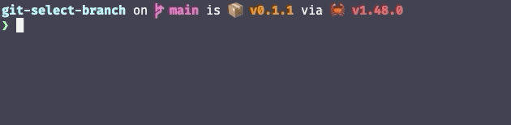

# git-select-branch

Tiny Rust CLI to checkout a recent git branch interactively.




## Installation

### Homebrew

```bash
brew tap dnjstrom/git-select-branch
brew install git-select-branch
```

### Cargo

```bash
cargo install git-select-branch
```

### Sources

```bash
git clone git@github.com:dnjstrom/git-select-branch.git
cd git-select-branch
cargo install --path .
```

## Git alias

Add the following section to your `~/.gitconfig`:

```toml
[alias]
  select-branch = "!git-select-branch"
```

Now you can simply type `git select-branch` to switch between branches.


## Publishing

1. Bump the version in `Cargo.toml` and commit.
2. Publish to crates.io by running `cargo publish`.
3. Run `./scripts/prepare-release-files.sh`.
4. Make a [new release](https://github.com/dnjstrom/git-select-branch/releases) including:
    * The **version** from `Cargo.toml`
    * The **file** at `./target/release/git-select-branch-mac.tar.gz`.
5. Edit the [hombrew tap](https://github.com/dnjstrom/homebrew-git-select-branch/edit/master/Formula/git-select-branch.rb) with the new information:
    * The **version** from `Cargo.toml`
    * The **link** from the [release page](https://github.com/dnjstrom/git-select-branch/releases) 
    * The **sha** from `./target/release/git-select-branch-mac.tar.gz.shasum`